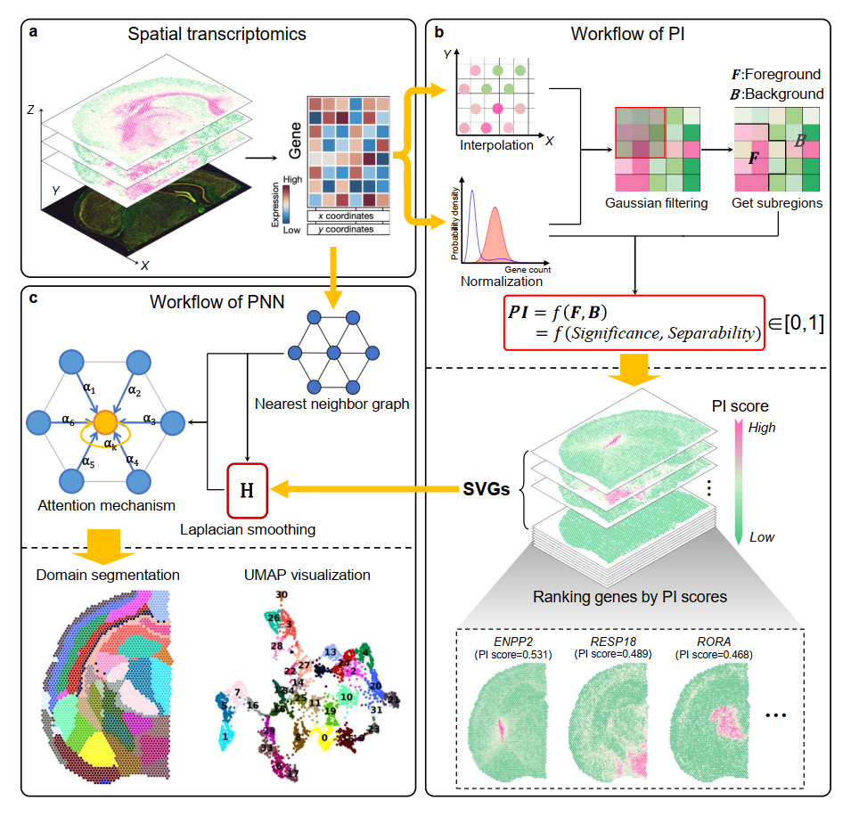

# PROST: A quantitative pattern recognition framework for spatial transcriptomics 
## Overview
`PROST` is a flexible framework to quantify gene spatial expression patterns and detect spatial tissue domains using spatially resolved transcriptomics with various resolutions. `PROST` consists of two independent workflows: **PROST Index (PI)** and **PROST Neural Network (PNN)**. 

Using `PROST` you can do:
* Quantitative identification of spatial patterns of gene expression changes by the proposed **PROST Index (PI)**.

* Unsupervised identification of spatial domains of ST data by using a **PROST Neural Network (PNN)**. 
---

## Installation
### 1. Prepare `Python` environment
To install `PROST`, we recommend using the [Anaconda](https://anaconda.org/) or [Miniconda](https://docs.conda.io/en/latest/miniconda.html) Python Distribution and creating an isolated environment, so that the `PROST` and dependencies don't conflict or interfere with other packages or applications. Please install the `conda` in advance, and record the conda installation directory `condapath` (such as:'C:/Users/PC/miniconda3' or '/user/miniconda3'). 

### Create environment 
First, please download or clone the `PROST-master.zip` file from github `Code` and unzip it. 

    git clone https://github.com/Tang-Lab-super/PROST.git

The entire installation process takes place in the `PROST-master` directory, so first go to that directory by:
   
    cd PROST-master

We recommend using a conda environment to configure PROST. To create the environment, run the following command in `bash` or `Anaconda Powershell Prompt`:

    conda create -n PROST1 python=3.7

You can activate the `PROST1` environment by: 

    conda activate PROST1

### Install dependency package 
a.If you want to install `PROST` in `Linux` environment, you can install the dependency package using `pip` by:
   
    pip install -r requirements.txt

b.If you want to install `PROST` in `Windows` environment, you may have trouble installing `rpy2`(see [rpy2](https://pypi.org/project/rpy2/)). We recommend following `two steps`:  
First, please install the dependency package first using `pip` by:

    pip install -r requirements_win.txt

Second, install `rpy2`. You may need to download the `.whl` installation file to install it manually, we have already downloaded the `rpy2-2.9.5-cp37-cp37m-win_amd64.whl` supported under `Windows` in the `PROST-master` directory, you can install it directly in this directory using the following statement:

    pip install rpy2-2.9.5-cp37-cp37m-win_amd64.whl

### 2. Prepare `R` environment
The `PROST` uses the `mclust` package in the `R` language environment, and links it in a `Python` environment via `rpy2`. You can install the `R` language environment under `PROST1` environment by:

    conda install r-base=4.0
    conda install r-mclust==5.4.10

### 3. Install `PROST`
Install the `PROST` package using:
                                          
    python setup.py build
    python setup.py install
    
If you encounter an error during the `build and install` process, it may be due to the setuptools version being too high, which can be solved by:

    pip install setuptools==58.2.0
    python setup.py build
    python setup.py install

Here, the environment configuration is completed!  
Before you can use `PROST`, you have to make sure that the following two steps are taken:
First, to execute in the `PROST1` environment;
Second, since `PROST` will use the `R` language in `Python`, you need to add the `R_HOME` and `R_USER` system paths, which we set in python by `os` using the code:

    condapath = "input your conda path"  
    os.environ['R_HOME'] = f'{condapath}/envs/PROST1/lib/R'
    os.environ['R_USER'] = f'{condapath}/envs/PROST1/lib/python3.7/site-packages/rpy2'

The `condapath` is the root directory of the conda mentioned at the beginning(such as:`C:/Users/PC/miniconda3` or `/user/miniconda3`). In the following three turorials, we have added these codes in jupyter notebook file, you just need to add your own `conda root path`.

### 4.Test `PROST`
We provide three analysis examples which from different types of spatial transcriptome data. We document the entire analysis using jupyter notebook, the code is available in the `./test` file under `PROST-master`. In this folder, the data are placed under `datasets`, and the results will be stored under `results`. If you want to run the `test example`, you must change the `root path` to `./test`. 

    cd ./test

You can run those examples with `ipython` or `Pycharm` under the `PROST1` environment. See the `Turorials` section below for details.

---

## Turorials
### Quick Start
* After `PROST` installation, we suggest downloading the complete tutorial examples from (The dataset is too large to upload to github)

* Our tutorial code is pre-written to run under `./test`, you have to change the path to `./test` and also place the downloaded datasets in `./test/datasets` so that you can get the results of the run in `./test/results`. For more flexibility, you may need to modify the `input_dir, output_dir and spatial_dir ` to make sure the paths are correct.

### [1.Application on 10x Visium human dorsolateral prefrontal cortex (DLPFC) dataset.](./docs/tutorials/DLPFC.md "In this vignette, we analyzed tissue section from the human dorsolateral prefrontal cortex (DLPFC) 10x Visium ST dataset, which was manually annotated as the cortical layers and white matter (WM)") 
* We performed `PROST` on the 10x Visium human dorsolateral prefrontal cortex (DLPFC) dataset from [(Pardo B. et al. 2022)](https://doi.org/10.1186/s12864-022-08601-w).
* The original data and manual annotation are prepared and aviliable at (https://drive.google.com/drive/folders/1a_barvf0oUXDqyivWUUmv5bu9KxUlYoo), or can be downloaded from (https://research.libd.org/spatialLIBD). 
* A Jupyter Notebook of the tutorial is accessible from : ([DLPFC.ipynb](./docs/vignettes/DLPFC.ipynb))

### [2. Application on Stereo-seq mouse olfactory bulb dataset.](./docs/tutorials/Stereo-seq.md "In this vignette, we analysis an ST dataset with cellular resolution (~14 μm in diameter per spot) generated by the Stereo-seq platform from mouse olfactory bulb tissue (add citation) to evaluate the performance of PROST on ST datasets with single-cell resolution.")
* We performed `PROST` on the Stereo-seq mouse olfactory bulb dataset from [(Huazhu Fu. et al. 2021)](https://doi.org/10.1101/2021.06.15.448542) generated by [Stereo-seq](https://doi.org/10.1016/j.cell.2022.04.003).
* We followed [(Kangning Dong. et al. 2022)](https://doi.org/10.1038/s41467-022-29439-6) to remove the spots outside the tissue section. The processed data can be downloaded from (https://drive.google.com/file/d/1Cay9ON1VNK3LVfcDfjhCjHUaG861L0Xg/view)
* A Jupyter Notebook of the tutorial is accessible from : ([Stereo-seq.ipynb](./docs/vignettes/Stereo-seq.ipynb))

### [3. Application on SeqFISH mouse embryo dataset.](./docs/tutorials/SeqFISH_mouse_embryo.md "In this vignette, we applied PROST onto a SeqFISH-profiled dataset to evaluate its general applicability.")
* We performed `PROST` on the mouse embryo ST data from [(Lohoff, T. et al. 2022)](https://doi.org/10.1038/s41587-021-01006-2) generated by [SeqFISH](https://spatial.caltech.edu/seqfish/).
* The original data can be downloaded from (https://crukci.shinyapps.io/SpatialMouseAtlas/), we also uploaded used data at (https://drive.google.com/drive/folders/1r5Cuo4YqZVtFPpB-VqDoHkMW6vhl9glf)
* A Jupyter Notebook of the tutorial is accessible from : ([SeqFISH_mouse_embryo.ipynb](./docs/vignettes/SeqFISH_mouse_embryo.ipynb))

---

## Improvements
We welcome any comments about `PROST`, and if you find bugs or have any ideas, feel free to leave a comment [FAQ](https://github.com/Tang-Lab-super/PROST/labels/FAQ).

---

