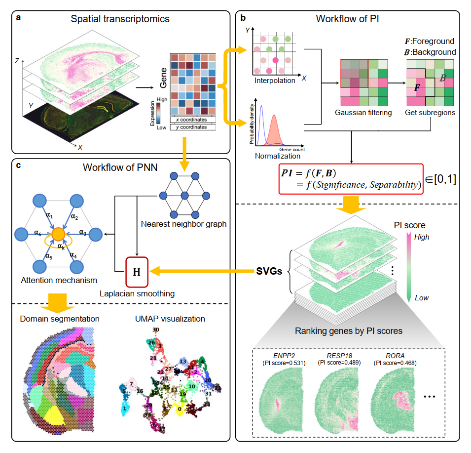

# PROST: A quantitative pattern recognition framework for spatial transcriptomics 
## Overview
`PROST` is a flexible framework to quantify gene spatial expression patterns and detect spatial tissue domains using spatially resolved transcriptomics with various resolutions. `PROST` consists of two independent workflows: **PROST Index (PI)** and **PROST Neural Network (PNN)**. 

Using `PROST` you can do:
* Quantitative identification of spatial patterns of gene expression changes by the proposed **PROST Index (PI)**.

* Unsupervised identification of spatial domains of ST data by using a **PROST Neural Network (PNN)**. 
---

## Turorials
### [1.Application on 10x Visium human dorsolateral prefrontal cortex (DLPFC) dataset.](./docs/tutorials/DLPFC.md "In this vignette, we analyzed tissue section from the human dorsolateral prefrontal cortex (DLPFC) 10x Visium ST dataset, which was manually annotated as the cortical layers and white matter (WM)") 
* We performed `PROST` on the 10x Visium human dorsolateral prefrontal cortex (DLPFC) dataset from [(Pardo B. et al. 2022)](https://doi.org/10.1186/s12864-022-08601-w).
* The original data and manual annotation are prepared and aviliable at (https://drive.google.com/drive/folders/1HlnH8DtyCGdxTVdMdBdI0xdu224zZy--?usp=share_link), or can be downloaded from (https://research.libd.org/spatialLIBD). 
* A Jupyter Notebook of the tutorial is accessible from : ([DLPFC.ipynb](./docs/vignettes/DLPFC.ipynb))

### [2. Application on Stereo-seq mouse olfactory bulb dataset.](./docs/tutorials/Stereo-seq.md "In this vignette, we analysis an ST dataset with cellular resolution (~14 μm in diameter per spot) generated by the Stereo-seq platform from mouse olfactory bulb tissue (add citation) to evaluate the performance of PROST on ST datasets with single-cell resolution.")
* We performed `PROST` on the Stereo-seq mouse olfactory bulb dataset from [(Huazhu Fu. et al. 2021)](https://doi.org/10.1101/2021.06.15.448542) generated by [Stereo-seq](https://doi.org/10.1016/j.cell.2022.04.003).
* We followed [(Kangning Dong. et al. 2022)](https://doi.org/10.1038/s41467-022-29439-6) to remove the spots outside the tissue section. The processed data can be downloaded from (https://drive.google.com/drive/folders/1HlnH8DtyCGdxTVdMdBdI0xdu224zZy--?usp=share_link)
* A Jupyter Notebook of the tutorial is accessible from : ([Stereo-seq.ipynb](./docs/vignettes/Stereo-seq.ipynb))

### [3. Application on SeqFISH mouse embryo dataset.](./docs/tutorials/SeqFISH_mouse_embryo.md "In this vignette, we applied PROST onto a SeqFISH-profiled dataset to evaluate its general applicability.")
* We performed `PROST` on the mouse embryo ST data from [(Lohoff, T. et al. 2022)](https://doi.org/10.1038/s41587-021-01006-2) generated by [seqFISH](https://spatial.caltech.edu/seqfish/).
* The original data can be downloaded from (https://crukci.shinyapps.io/SpatialMouseAtlas/)
* A Jupyter Notebook of the tutorial is accessible from : ([SeqFISH_mouse_embryo.ipynb](./docs/vignettes/SeqFISH_mouse_embryo.ipynb))
---

## Installation
### 1. Prepare `Python` environment
To install `PROST`, we recommend using the [Anaconda Python Distribution](https://anaconda.org/) and creating an isolated environment, so that the `PROST` and dependencies don't conflict or interfere with other packages or applications. To create the environment, run the following script in command line:

    conda create -n PROST python=3.7

After create the environment, you can activate the `PROST` environment by: 

    conda activate PROST

### 2. Install `PROST`

Install the dependency package using `pip` by:
   
    pip install -r requirements.txt

If you want to use `PROST` in a windows environment, you may have trouble installing `rpy2`, then please see [rpy2](https://pypi.org/project/rpy2/), you may need to download the `.whl` installation file to install it manually.

Install the `PROST` package using:
                                          
    cd PROST-master
    python setup.py build
    python setup.py install

### 3. Prepare `R` environment
This algorithm uses the `mclust` package in the `R` language environment, and requires `rpy2` in the python environment. We recommend using the [Anaconda Python Distribution](https://anaconda.org/) and creating an isolated environment.

    conda create -n R-PROST r-base=4.2
    conda activate R-PROST
    conda install r-mclust==5.4.10

and then you must add the new `R` language path as the `R_HOME` and the `rpy2` package path as the `R_USER` by `os` in python before you using `PROST`. For more details, please refer to the [`DLPFC_test.py`](./test/DLPFC_test.py) under `./test`. 

    os.environ['R_HOME'] = '{your conda path}/envs/R-PROST/lib/R'
    os.environ['R_USER'] = '{your conda path}/envs/PROST1/lib/python3.7/site-packages/rpy2'

---

## Improvements
We welcome any comments about `PROST`, and if you find bugs or have any ideas, feel free to leave a comment [FAQ](https://github.com/Tang-Lab-super/PROST/labels/FAQ).
