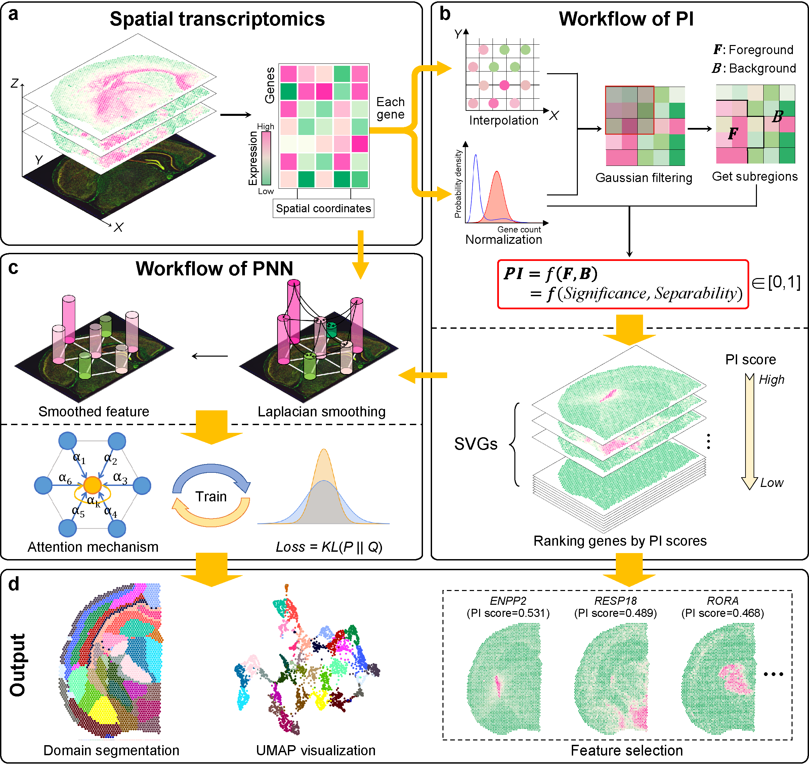

# PROST: A quantitative pattern recognition framework for spatial transcriptomics 
## Overview
`PROST` is a flexible framework to quantify gene spatial expression patterns and detect spatial tissue domains using spatially resolved transcriptomics with various resolutions. `PROST` consists of two independent workflows: **PROST Index (PI)** and **PROST Neural Network (PNN)**. 

Using `PROST` you can do:
* Quantitative identification of spatial patterns of gene expression changes by the proposed **PROST Index (PI)**.

* Unsupervised identification of spatial tissue domains using a **PROST Neural Network (PNN)**. 

## Installation and Turorials
If you want to run `PROST`, please visit our [**Document**](https://prost-doc.readthedocs.io/en/latest/index.html) , which contains the installation, usage, and tutorials of `PROST`.

## Easy Start
After `installation`, we suggest downloading the complete tutorial examples from [**zenodo**](https://doi.org/10.5281/zenodo.7827565)  (The dataset is too large to upload to github, there only 1 case (151672) of DLPFC data).   
Similarly, you can download the dataset for each turorial individually via the [**google drive**](https://drive.google.com/drive/folders/1HlnH8DtyCGdxTVdMdBdI0xdu224zZy--) in the tutorial. 

## Improvements
We welcome any comments about `PROST`, and if you find bugs or have any ideas, feel free to leave a comment [FAQ](https://github.com/Tang-Lab-super/PROST/labels/FAQ).
`PROST` doesn't fully test on `macOS`.

---
