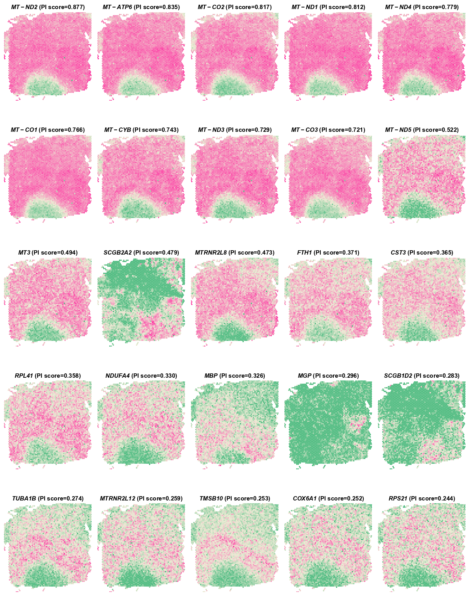
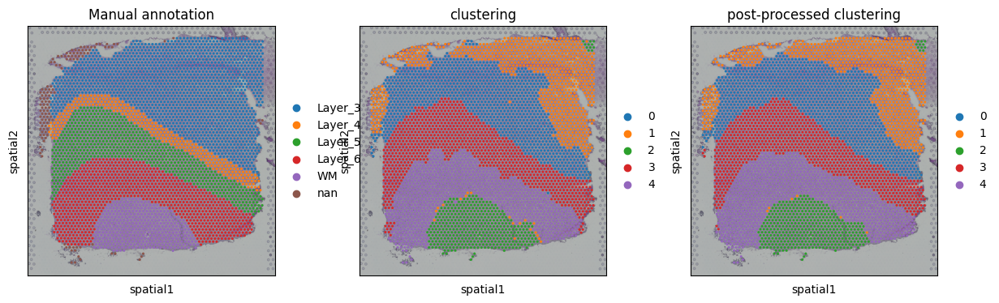
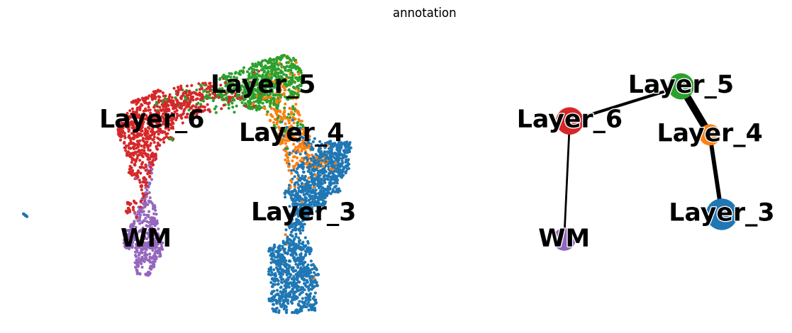

# DLPFC Analysis
In this vignette, we analyzed tissue section from the human dorsolateral prefrontal cortex (DLPFC) 10x Visium ST dataset, which was manually annotated as the cortical layers and white matter (WM). The manual annotations were used as the ground truth to evaluate the accuracy of spatial domain segmentation.

---
## Identify SVGs
### 1.Load PROST and its dependent packages

    import pandas as pd 
    import numpy as np 
    import scanpy as sc 
    import os 
    import warnings 
    warnings.filterwarnings("ignore") 
    import matplotlib as mpl 
    import matplotlib.pyplot as plt 
    import PROST 
    PROST.__version__ 

    >>> ' 1.1.2 '

### 2.Set up the working environment and import data 

    # the location of R (used for the mclust clustering)
    ENVpath = "your path of PROST_ENV"            # refer to 'How to use    PROST' section
    os.environ['R_HOME'] = f'{ENVpath}/lib/R'
    os.environ['R_USER'] = f'{ENVpath}/lib/python3.7/site-packages/rpy2'
    
    # Set seed
    SEED = 818
    PROST.setup_seed(SEED)
    
    #%% Read in data
    section_num = 151672
    
    # Set directory (If you want to use additional data, please     change the file path)
    rootdir = 'datasets/DLPFC'
    
    input_dir = os.path.join(f'{rootdir}', str(section_num))
    spatial_dir = os.path.join(f'{rootdir}', str(section_num),  'spatial')
    output_dir = os.path.join(f'{rootdir}', str(section_num),   'results')
    if not os.path.isdir(output_dir):
        os.makedirs(output_dir)

    # Read data from input_dir
    adata = sc.read_visium(path=input_dir, count_file='{}_filtered_feature_bc_matrix.h5'.format(section_num))
    adata.var_names_make_unique()

### 3.Calculate and save PI

    adata = PROST.prepare_for_PI(adata, platform="visium")
    adata = PROST.cal_prost_index(adata, platform="visium")
    adata.write_h5ad(output_dir+"/PI_result.h5")

    >>> Variable names are not unique. To make them unique, call `.var_names_make_unique`.
    >>> Variable names are not unique. To make them unique, call `.var_names_make_unique`.
    >>> Filtering genes ...
    >>> Calculating image index 1D:
    >>> 100%|██████████| 4015/4015 [00:00<00:00, 70423.08it/s]
    >>> Trying to set attribute `.var` of view, copying.
    >>> Normalization to each gene:
    >>> 100%|██████████| 5083/5083 [00:00<00:00, 13624.30it/s]
    >>> Gaussian filtering for each gene:
    >>> 100%|██████████| 5083/5083 [01:07<00:00, 74.99it/s]
    >>> Binary segmentation for each gene:
    >>> 100%|██████████| 5083/5083 [03:44<00:00, 22.60it/s]
    >>> Spliting subregions for each gene:
    >>> 100%|██████████| 5083/5083 [01:14<00:00, 68.52it/s]
    >>> Computing PROST Index for each gene:
    >>> 100%|██████████| 5083/5083 [00:03<00:00, 1478.57it/s]
    >>> PROST Index calculation completed !!
    

### 4.Draw SVGs detected by PI
    PROST.plot_gene(adata, platform="visium",size = 2, sorted_by = "PI", top_n = 25,save_path = output_dir)

    >>> ... storing 'feature_types' as categorical
    >>> ... storing 'genome' as categorical
    >>> Drawing pictures:
    >>> 100%|██████████| 1/1 [00:09<00:00,  9.55s/it]
    >>> Drawing completed !!

### 5.Calculate Moran'I and Geary'C for SVGs dected by PI  
To assess the credibility of SVGs detected by these methods, we respectively used the spatial information of SVGs to calculate Moran’s I and Geary’s C statistics. 

    PROST.cal_moran_I_and_geary_C_for_PI_SVGs(adata, PI_top_n=50, save_path = output_dir)

    >>> 100%|██████████| 50/50 [00:28<00:00,  1.73it/s]
    >>> Average Moran'I of SVGs detected by PI = 0.4530851882366425 
    >>> Median Moran'I of SVGs detected by PI = 0.3949756315601886 
    >>> Average Geary'C of SVGs detected by PI = 0.5463279557091569 
    >>> Median Geary'C of SVGs detected by PI = 0.603879980983322

|    | geneID    | PI       | Moran_I  | Geary_C  |
|----|-----------|----------|----------|----------|
| 0  | MT-ND2    | 0.876836 | 0.710244 | 0.286052 |
| 1  | MT-ATP6   | 0.834577 | 0.718307 | 0.279474 |
| 2  | MT-CO2    | 0.816857 | 0.735137 | 0.265031 |
| 3  | MT-ND1    | 0.811519 | 0.719740 | 0.276575 |
| 4  | MT-ND4    | 0.778537 | 0.709382 | 0.286116 |
| 5  | MT-CO1    | 0.765785 | 0.718532 | 0.278538 |
| 6  | MT-CYB    | 0.742643 | 0.685484 | 0.314671 |
| 7  | MT-ND3    | 0.729128 | 0.694250 | 0.305809 |
| 8  | MT-CO3    | 0.720694 | 0.732460 | 0.268270 |
| 9  | MT-ND5    | 0.521871 | 0.504742 | 0.494602 |
| 10 | MT3       | 0.493878 | 0.503795 | 0.495233 |
| 11 | SCGB2A2   | 0.478912 | 0.680801 | 0.326584 |
| 12 | MTRNR2L8  | 0.473016 | 0.594114 | 0.403804 |
| 13 | FTH1      | 0.371137 | 0.464734 | 0.536722 |
| 14 | CST3      | 0.364869 | 0.484264 | 0.514394 |
| 15 | RPL41     | 0.357543 | 0.430153 | 0.565999 |
| 16 | NDUFA4    | 0.330432 | 0.423861 | 0.579269 |
| 17 | MBP       | 0.326337 | 0.494592 | 0.505158 |
| 18 | MGP       | 0.296306 | 0.468846 | 0.522271 |
| 19 | SCGB1D2   | 0.282661 | 0.495585 | 0.504803 |
| 20 | TUBA1B    | 0.274488 | 0.455331 | 0.543853 |
| 21 | MTRNR2L12 | 0.259394 | 0.409218 | 0.592105 |
| 22 | TMSB10    | 0.252886 | 0.492274 | 0.509731 |
| 23 | COX6A1    | 0.251861 | 0.379592 | 0.615655 |
| 24 | RPS21     | 0.243671 | 0.345257 | 0.655808 |
| 25 | CLU       | 0.243390 | 0.360654 | 0.640380 |
| 26 | CALM1     | 0.241974 | 0.341966 | 0.657869 |
| 27 | RPL34     | 0.241642 | 0.377486 | 0.626673 |
| 28 | RPL37A    | 0.235148 | 0.365629 | 0.630671 |
| 29 | GAPDH     | 0.234806 | 0.362507 | 0.637499 |
| 30 | SELENOW   | 0.232361 | 0.338193 | 0.663821 |
| 31 | COX6C     | 0.232221 | 0.457555 | 0.541740 |
| 32 | ATP5F1E   | 0.232024 | 0.341070 | 0.657950 |
| 33 | GNAS      | 0.223289 | 0.380733 | 0.617523 |
| 34 | COX4I1    | 0.222081 | 0.336472 | 0.662381 |
| 35 | SNAP25    | 0.214184 | 0.410525 | 0.590272 |
| 36 | MT-ND4L   | 0.214032 | 0.322941 | 0.677345 |
| 37 | CKB       | 0.213443 | 0.331925 | 0.666499 |
| 38 | FTL       | 0.212927 | 0.357595 | 0.643404 |
| 39 | NRGN      | 0.210670 | 0.344608 | 0.652806 |
| 40 | RPS28     | 0.210552 | 0.339370 | 0.658813 |
| 41 | PPIA      | 0.210144 | 0.306437 | 0.696177 |
| 42 | SAA1      | 0.208795 | 0.357856 | 0.638305 |
| 43 | CALM2     | 0.206207 | 0.322927 | 0.677944 |
| 44 | OLFM1     | 0.200591 | 0.290383 | 0.708072 |
| 45 | RPL32     | 0.192678 | 0.302734 | 0.696434 |
| 46 | TMSB4X    | 0.191757 | 0.317970 | 0.681999 |
| 47 | PCSK1N    | 0.191165 | 0.297974 | 0.704676 |
| 48 | RPS27A    | 0.189860 | 0.313465 | 0.684624 |
| 49 | COX7C     | 0.188659 | 0.324590 | 0.675992 |

--- 
## Clustering 
    # Set the number of clusters
    n_clusters = 5
    
### 1.Read PI result and Expression data preprocessing
    adata = sc.read(output_dir+"/PI_result.h5")

    sc.pp.normalize_total(adata)
    sc.pp.log1p(adata)
    adata = PROST.feature_selection(adata, save_path = output_dir, by = "prost", n_top_genes = 3000)

### 2.Run PROST clustering
    PROST.run_prost_clust(adata,
                        platform="visium",
                        key_added = "PROST",
                        init="mclust",                         
                        n_clusters = n_clusters,                        
                        gnnlayers = 2,              
                        laplacin_filter = True,                        
                        lr = 0.1,                         
                        SEED=SEED,                          
                        max_epochs = 500,                        
                        tol = 5e-3,                        
                        post_processing = True,                        
                        pp_run_times = 3)

### 3.Save result
    adata.write_h5ad(output_dir+"/PNN_result.h5")   
    clustering = adata.obs["clustering"]
    clustering.to_csv(output_dir+"/clusters.csv",header = False)
    pp_clustering = adata.obs["pp_clustering"] 
    pp_clustering.to_csv(output_dir+"/pp_clusters.csv",header = False)
    embedding = adata.obsm["PROST"]
    np.savetxt(output_dir+"/embedding.txt",embedding)

    
    >>> Calculating adjacency matrix ...
    >>> Running PCA ...
    >>> Laplacian Smoothing ...
    >>> Initializing cluster centers with mclust, n_clusters known
    >>> Epoch: : 501it [09:07,  1.09s/it, loss=0.093866244]                       
    >>> Clustering completed !!
    >>> Post-processing for clustering result ...
    >>> Refining clusters, run times: 1/3
    >>> Refining clusters, run times: 2/3
    >>> Refining clusters, run times: 3/3

### 4.Plot clustering results 

    plt.rcParams["figure.figsize"] = (4,4)
    sc.pl.spatial(adata, 
                    img_key = "hires", 
                    color = ["annotation","clustering","pp_clustering"],
                    title = ["Manual annotation",'clustering','post-processed clustering'],                
                    na_in_legend = False,
                    ncols = 3,
                    size = 1)

    
    >>> storing 'annotation' as categorical

### 5.Calculate ARI and NMI 
To compare the domain segmentation performance quantitatively, we used the Adjusted Rand Index (ARI) and Normalized Mutual Information (NMI) to measure the similarity between the predicted domains and the manual annotations across all twelve sections of the DLPFC dataset.

    ARI, NMI, silhouette_score = PROST.cal_metrics_for_DLPFC(adata.obs["pp_clustering"], labels_true_path = input_dir+'/cluster_labels.csv')

    
    >>> ARI = 0.5910397042708356 
    >>> AMI = 0.6813238415316797 
    >>> NMI = 0.6818348825641031 
    >>> v_measure_score = 0.6818348825641031 
    >>> silhouette_score = 0.3681630775671734 
    ==================================================

### 6.Plot UMAP and PAGA graph 
Next, the embeddings generated by PROST was applied to UMAP for visualization and PAGA for inferring trajectory.

    adata = sc.read_visium(path=input_dir, count_file='{}   _filtered_feature_bc_matrix.h5'.format(section_num))
    adata.var_names_make_unique()
    # Read annotation
    labels_true = pd.read_csv(input_dir+'/cluster_labels.csv')
    labels_true.index = labels_true["key"].str[7:]
    adata.obs["annotation"] = labels_true["ground_truth"]
    adata.obs["annotation"] = adata.obs["annotation"].astype('category').   astype('str')
    used_adata = adata[adata.obs["annotation"]!='nan']
    prost_embed = pd.read_csv(output_dir+"/embedding.txt",header = None,    delim_whitespace=True)
    prost_embed.index = labels_true.index
    adata.obsm["PROST"] = prost_embed
    # Plot
    plt.rcParams["figure.figsize"] = (6,5)
    sc.pp.neighbors(used_adata, use_rep="PROST")
    sc.tl.umap(used_adata)
    sc.tl.paga(used_adata,groups='annotation')
    sc.pl.paga_compare(used_adata, color="annotation",random_state=1,
                                 size = 35,legend_fontsize=25,  node_size_scale=4,
                                 frameon=False, show = False,fontoutline = 2)

    >>> Variable names are not unique. To make them unique, call `.var_names_make_unique`.
    >>> Variable names are not unique. To make them unique, call `.var_names_make_unique`.
    >>> ... storing 'annotation' as categorical
    >>> ... storing 'feature_types' as categorical
    >>> ... storing 'genome' as categorical
    >>> [<Axes:xlabel='UMAP1', ylabel='UMAP2'>, <Axes:>]

