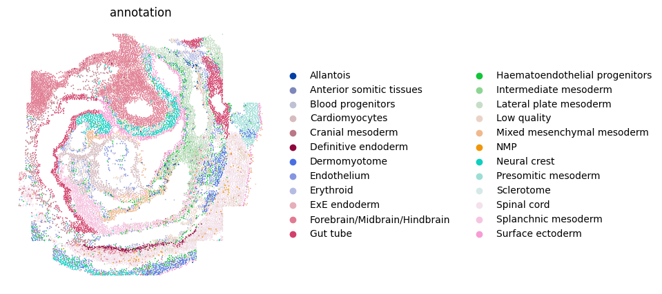
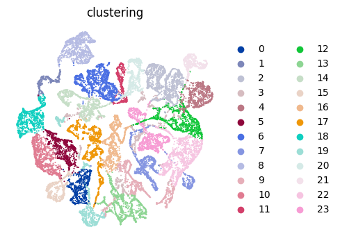

# SeqFISH mouse embryo Analysis 
In this vignette, We applied PROST onto a SeqFISH-profiled dataset to evaluate its general applicability. 

---
## Identify SVGs
### 1.Load PROST and its dependent packages

    import pandas as pd 
    import numpy as np 
    import scanpy as sc 
    import os 
    import warnings 
    warnings.filterwarnings("ignore") 
    import matplotlib as mpl 
    import matplotlib.pyplot as plt 
    import PROST 
    PROST.__version__ 

    >>> ' 1.1.2 '

### 2.Set up the working environment and import data 

    # the location of R (used for the mclust clustering)
    ENVpath = "your path of PROST_ENV"  
    os.environ['R_HOME'] = f'{ENVpath}/lib/R'
    os.environ['R_USER'] = f'{ENVpath}/lib/python3.7/site-packages/rpy2'

    # Set seed
    SEED = 818
    PROST.setup_seed(SEED)
    
    # Set directory
    input_dir = os.path.join('datasets', 'SeqFISH/')
    output_dir = os.path.join('results','SeqFISH_result/')
    if not os.path.isdir(output_dir):
        os.makedirs(output_dir)

    # Read counts and metadata
    counts = pd.read_csv(input_dir + "counts.txt", sep = "\t")
    metadata = pd.read_csv(input_dir + "metadata.txt", sep = "\t")
    gene_name = counts.index

    # Create anndata for embryo1 (embryo2 or embryo3)
    '''Embryo1'''
    metadata_embryo1 = metadata[metadata["embryo"]=="embryo1"]
    counts_embryo1 = counts.loc[:,metadata_embryo1["uniqueID"]]
    spatial_embryo1 = metadata_embryo1[["x_global","y_global"]]
    spatial_embryo1.index = metadata_embryo1["uniqueID"]

    # Create anndata
    adata = sc.AnnData(counts_embryo1.T)
    adata.var_names_make_unique()
    # read spatial
    adata.obsm["spatial"] = spatial_embryo1.to_numpy()

    # read annotation
    annotation = metadata_embryo1["celltype_mapped_refined"]
    annotation.index = metadata_embryo1["uniqueID"]
    adata.obs["annotation"] = annotation
    adata.write_h5ad(output_dir+"/used_data1.h5")

    >>> ... storing 'annotation' as categorical
    >>> 'Embryo3'

### 3.Calculate and save PI

    adata=sc.read(output_dir+"/used_data1.h5")
    adata = PROST.prepare_for_PI(adata, percentage = 0.01, platform="SeqFISH")
    adata = PROST.cal_prost_index(adata, connect_kernel_size=8, neighbors=8,    platform="SeqFISH",del_rate=0.05)
    adata.write_h5ad(output_dir+"/PI_result.h5")

    >>> Filtering genes ...
    >>> Trying to set attribute `.var` of view, copying.
    >>> Normalization to each gene:
    >>> 100%|██████████| 351/351 [00:00<00:00, 5237.45it/s]
    >>> Gaussian filtering for each gene:
    >>> 100%|██████████| 351/351 [00:40<00:00,  8.67it/s]
    >>> Binary segmentation for each gene:
    >>> 100%|██████████| 351/351 [00:00<00:00, 18470.16it/s]
    >>> Spliting subregions for each gene:
    >>> 100%|██████████| 351/351 [00:00<00:00, 8355.38it/s]
    >>> Computing PROST Index for each gene:
    >>> 100%|██████████| 351/351 [00:39<00:00,  8.99it/s]
    >>> PROST Index calculation completed !!

### 4.Draw SVGs detected by PI
    PROST.plot_gene(adata, platform="SeqFISH", size = 0.3, top_n = 25, ncols_each_sheet = 5, nrows_each_sheet = 5,save_path = output_dir)

    >>> Drawing pictures:
    >>> 100%|██████████| 1/1 [00:15<00:00, 15.74s/it]
    >>> Drawing completed !!

### 5.Calculate Moran'I and Geary'C for SVGs dected by PI  
To assess the credibility of SVGs detected by these methods, we respectively used the spatial information of SVGs to calculate Moran’s I and Geary’s C statistics. 

    PROST.cal_moran_I_and_geary_C_for_PI_SVGs(adata, PI_top_n=50, save_path = output_dir)

    >>> 100%|██████████| 50/50 [20:36<00:00, 24.73s/it]
    >>> Average Moran'I of SVGs detected by PI = 0.34560184671132244 
    >>> Median Moran'I of SVGs detected by PI = 0.36483518066319803 
    >>> Average Geary'C of SVGs detected by PI = 0.6171409870242501 
    >>> Median Geary'C of SVGs detected by PI = 0.5998499527724659

|    |  geneID |       PI |  Moran_I |  Geary_C |
|---:|--------:|---------:|---------:|---------:|
|  0 |   Hoxb9 | 1.000000 | 0.488931 | 0.465319 |
|  1 |    Cdx2 | 0.566876 | 0.411493 | 0.548865 |
|  2 |   Hoxc8 | 0.558326 | 0.302270 | 0.661814 |
|  3 |   Wnt5a | 0.554483 | 0.429061 | 0.535140 |
|  4 |   Bambi | 0.483233 | 0.424679 | 0.537970 |
|  5 |   Hoxa9 | 0.479378 | 0.348462 | 0.628304 |
|  6 |   Hoxb4 | 0.465979 | 0.291391 | 0.673090 |
|  7 |   Hoxb3 | 0.453696 | 0.275454 | 0.681236 |
|  8 | Tmem119 | 0.449840 | 0.420086 | 0.532817 |
|  9 |   Fgfr2 | 0.440052 | 0.296640 | 0.670719 |
| 10 |   Dusp6 | 0.436945 | 0.409998 | 0.546796 |
| 11 |  Tfap2b | 0.393255 | 0.370571 | 0.585511 |
| 12 |  Tfap2a | 0.388913 | 0.325753 | 0.623145 |
| 13 |   Smim1 | 0.384021 | 0.259597 | 0.701088 |
| 14 | Aldh1a2 | 0.379967 | 0.441316 | 0.526007 |
| 15 |  Hoxa11 | 0.350988 | 0.294576 | 0.655135 |
| 16 |    Tgm1 | 0.346816 | 0.055714 | 0.915164 |
| 17 |   Snai1 | 0.341068 | 0.361320 | 0.599254 |
| 18 |    Apln | 0.340328 | 0.126965 | 0.830317 |
| 19 |     Ttn | 0.338863 | 0.628871 | 0.343572 |
| 20 |   Cldn4 | 0.330571 | 0.427771 | 0.530761 |
| 21 |    Tbx4 | 0.321771 | 0.442577 | 0.498330 |
| 22 |   Sox10 | 0.318814 | 0.335579 | 0.630862 |
| 23 |   Hoxd9 | 0.318049 | 0.225928 | 0.741588 |
| 24 |   Hemgn | 0.309839 | 0.128971 | 0.838806 |
| 25 |    Tbx5 | 0.308528 | 0.441978 | 0.515955 |
| 26 |    Msx1 | 0.304036 | 0.459791 | 0.498687 |
| 27 |    Hcn4 | 0.297837 | 0.530591 | 0.472810 |
| 28 |   Suz12 | 0.296183 | 0.143624 | 0.823324 |
| 29 |    Evx1 | 0.290166 | 0.313486 | 0.646443 |
| 30 |    Wnt2 | 0.289947 | 0.494649 | 0.471269 |
| 31 |   Cntfr | 0.288735 | 0.378909 | 0.587733 |
| 32 |   Kmt2d | 0.283215 | 0.199363 | 0.765696 |
| 33 |     Afp | 0.273933 | 0.133562 | 0.840113 |
| 34 |   Hand1 | 0.271916 | 0.457340 | 0.501484 |
| 35 |   Hoxb1 | 0.271296 | 0.439619 | 0.527100 |
| 36 |   Sfrp5 | 0.271183 | 0.368350 | 0.600446 |
| 37 |   Podxl | 0.267092 | 0.420093 | 0.544644 |
| 38 |    Rgl1 | 0.265776 | 0.168780 | 0.792695 |
| 39 |  Popdc2 | 0.263662 | 0.552754 | 0.417445 |
| 40 |   Nanog | 0.260469 | 0.080936 | 0.879910 |
| 41 |  Dnmt3a | 0.259922 | 0.285143 | 0.681970 |
| 42 |  Pdgfra | 0.257661 | 0.416672 | 0.540798 |
| 43 |   Gata4 | 0.256379 | 0.544601 | 0.425685 |
| 44 | Cbfa2t3 | 0.255569 | 0.174157 | 0.785340 |
| 45 |  Tcf7l1 | 0.254504 | 0.186455 | 0.777835 |
| 46 |  Slc4a1 | 0.254302 | 0.321962 | 0.624245 |
| 47 |   Pdgfa | 0.252928 | 0.308816 | 0.644064 |
| 48 |   Gata5 | 0.252056 | 0.499571 | 0.458818 |
| 49 |   Gata6 | 0.251892 | 0.434917 | 0.530933 |

--- 
## Clustering 
### 1.Read PI result and Expression data preprocessing
    PROST.setup_seed(SEED)
    # Read PI result
    adata = sc.read(output_dir+"/PI_result.h5")

    sc.pp.normalize_total(adata)
    sc.pp.log1p(adata)

### 2.Run PROST clustering
    PROST.run_prost_clust(adata, 
                        platform="SeqFISH", 
                        min_distance = 3,
                        init="mclust",
                        n_clusters = 24,                      
                        tol = 5e-3,
                        laplacin_filter = True,
                        lr = 0.1, 
                        SEED=SEED,
                        max_epochs = 500,
                        post_processing = False)

### 3.Save result
    adata.write_h5ad(output_dir + "/PNN_result.h5")
    clustering = adata.obs["clustering"]
    clustering.to_csv(output_dir + "/clusters.csv",header = False)
    embedding = adata.obsm["PROST"]
    np.savetxt(output_dir + "/embedding.txt",embedding)

    
    >>> Calculating adjacency matrix ...
    >>> Running PCA ...
    >>> Laplacian Smoothing ...
    >>> Initializing cluster centers with mclust, n_clusters known
    >>> Epoch: : 501it [3:17:42, 23.68s/it, loss=0.28359604]                         
    >>> Clustering completed !!

### 4.Plot annotation

    plt.rcParams["figure.figsize"] = (5,5)
    ax = sc.pl.embedding(adata, basis="spatial", color="annotation",size = 7,s=6, show=False, title='annotation')
    ax.invert_yaxis()
    plt.axis('off')
    plt.savefig(output_dir+"/annotation.png", dpi=600, bbox_inches='tight')

### 5.Plot clustering result
    plt.rcParams["figure.figsize"] = (5,5)
    ax = sc.pl.embedding(adata, basis="spatial", color="clustering",size = 7,s=6, show=False, title='clustering')
    ax.invert_yaxis()
    plt.axis('off')
    plt.savefig(output_dir+"/clustering.png", dpi=600, bbox_inches='tight')

### 6.Plot UMAP
    plt.rcParams["figure.figsize"] = (4,4)
    sc.pp.neighbors(adata, use_rep="PROST")
    sc.tl.umap(adata)
    ax = sc.pl.umap(adata, color="clustering", frameon=False, size=8,show = False)
    plt.axis('off')
    plt.subplots_adjust()
    plt.savefig(output_dir+"/umap.png", dpi=600,bbox_inches='tight')

