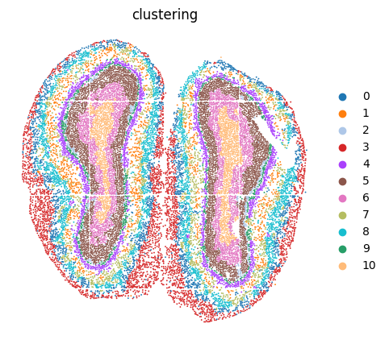
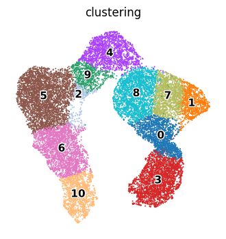

# Stereo-seq  Analysis
In this vignette, we analysis an ST dataset with cellular resolution (~14 μm in diameter per spot) generated by the Stereo-seq platform from mouse olfactory bulb tissue (add citation) to evaluate the performance of PROST on ST datasets with single-cell resolution.

---
## Identify SVGs
### 1.Load PROST and its dependent packages

    import pandas as pd
    import numpy as np
    import scanpy as sc
    import os
    import warnings
    warnings.filterwarnings("ignore")
    import matplotlib.pyplot as plt
    import matplotlib as mpl
    import sys
    import PROST
    PROST.__version__

    >>> ' 1.1.2 '

### 2.Set up the working environment and import data 

    # the location of R (used for the mclust clustering)
    ENVpath = "your path of PROST_ENV"  
    os.environ['R_HOME'] = f'{ENVpath}/lib/R'
    os.environ['R_USER'] = f'{ENVpath}/lib/python3.7/site-packages/rpy2'

    # Set seed
    SEED = 818
    PROST.setup_seed(SEED)
    
    # Set the number of clusters
    n_clusters = 11

    # set dir
    input_dir = os.path.join('datasets', 'Stereo-seq/')
    output_dir = os.path.join('results','Stereo-seq_result')
    if not os.path.isdir(output_dir):
        os.makedirs(output_dir)

    # Read data from input_dir
    adata=sc.read(input_dir+"/used_data.h5")

### 3.Calculate and save PI

    adata = PROST.prepare_for_PI(adata, percentage = 0.01, platform="stereo-seq")
    adata = PROST.cal_prost_index(adata, connect_kernel_size=6, neighbors=8,    platform="stereo-seq")
    adata.write_h5ad(output_dir+"/PI_result.h5")

    >>> Filtering genes ...
    >>> Trying to set attribute `.var` of view, copying.
    >>> Normalization to each gene:
    >>> 100%|██████████| 8520/8520 [00:02<00:00, 2871.91it/s]
    >>> Gaussian filtering for each gene:
    >>> 100%|██████████| 8520/8520 [18:07<00:00,  7.83it/s]
    >>> Binary segmentation for each gene:
    >>> 100%|██████████| 8520/8520 [00:29<00:00, 285.26it/s]
    >>> Spliting subregions for each gene:
    >>> 100%|██████████| 8520/8520 [01:39<00:00, 85.66it/s]
    >>> Computing PROST Index for each gene:
    >>> 100%|██████████| 8520/8520 [18:21<00:00,  7.74it/s]
    >>> PROST Index calculation completed !!

    

### 4.Draw SVGs detected by PI
    PROST.plot_gene(adata, platform="stereo-seq", size = 0.3, top_n = 25, ncols_each_sheet = 5, nrows_each_sheet = 5,save_path = output_dir)    

    >>> Drawing pictures:
    >>> 100%|██████████| 1/1 [00:15<00:00, 15.58s/it]
    >>> Drawing completed !!

--- 
## Clustering 
### 1.Read PI result and Expression data preprocessing
    PROST.setup_seed(SEED)
    adata = sc.read(output_dir+"/PI_result.h5")

    sc.pp.normalize_total(adata)
    sc.pp.log1p(adata)
    adata = PROST.feature_selection(adata, save_path = output_dir, by = "prost",    n_top_genes = 3000)

    adata

    >>> View of AnnData object with n_obs × n_vars = 19109 × 2527
         obs: 'n_genes_by_counts', 'log1p_n_genes_by_counts', 'total_counts', 'log1p_total_counts', 'pct_counts_in_top_50_genes',    'pct_counts_in_top_100_genes', 'pct_counts_in_top_200_genes', 'pct_counts_in_top_500_genes'
         var: 'n_cells_by_counts', 'mean_counts', 'log1p_mean_counts', 'pct_dropout_by_counts', 'total_counts', 'log1p_total_counts',    'n_cells', 'SEP', 'SIG', 'PI', 'selected'
         uns: 'binary_image', 'del_index', 'gau_fea', 'locates', 'nor_counts', 'shape', 'subregions', 'log1p'
         obsm: 'spatial'

### 2.Run PROST clustering
    PROST.run_prost_clust(adata, 
                        platform="stereo-seq", 
                        min_distance = 50,
                        init="mclust",
                        n_clusters = n_clusters,                     
                        tol = 5e-3,
                        laplacin_filter = True,
                        SEED=SEED,
                        max_epochs = 500,
                        post_processing = False)
    

    >>> Calculating adjacency matrix ...
    >>> Running PCA ...
    >>> Laplacian Smoothing ...
    >>> Initializing cluster centers with mclust, n_clusters known
    >>> Epoch: : 501it [3:07:58, 22.51s/it, loss=0. 24661717]                         
    >>> Clustering completed !!

### 3.Save result
    adata.write_h5ad(output_dir + "/PNN_result.h5")
    clustering = adata.obs["clustering"]
    clustering.to_csv(output_dir + "/clusters.csv",header = False)

### 4.Plot clustering results 
    color_list = ['#1f77b4', '#ff7f0e', '#aec7e8', '#d62728', '#aa40fc', '#8c564b',
                  '#e377c2', '#b5bd61', '#17becf', '#279e68', '#ffbb78']
    adata.uns["clustering"+"_colors"] = color_list
    plt.rcParams["figure.figsize"] = (5,5)
    sc.pl.embedding(adata, basis="spatial", color="clustering",size = 7,s=6, show=False, title='clustering')
    plt.axis('off')
    plt.savefig(output_dir+"/clustering.png", dpi=600, bbox_inches='tight')

### 5.Plot UMAP
Next, the embeddings generated by PROST was applied to UMAP for visualization.

    plt.rcParams["figure.figsize"] = (4,4)
    sc.pp.neighbors(adata, use_rep="PROST")
    sc.tl.umap(adata)
    ax = sc.pl.umap(adata, color="clustering", frameon=False, size=8,
                            show = False,legend_loc='on data',legend_fontoutline=2,legend_fontsize=11,
                            )
    plt.axis('off')
    plt.subplots_adjust()
    plt.savefig(output_dir+"/umap.png", dpi=600,bbox_inches='tight')

